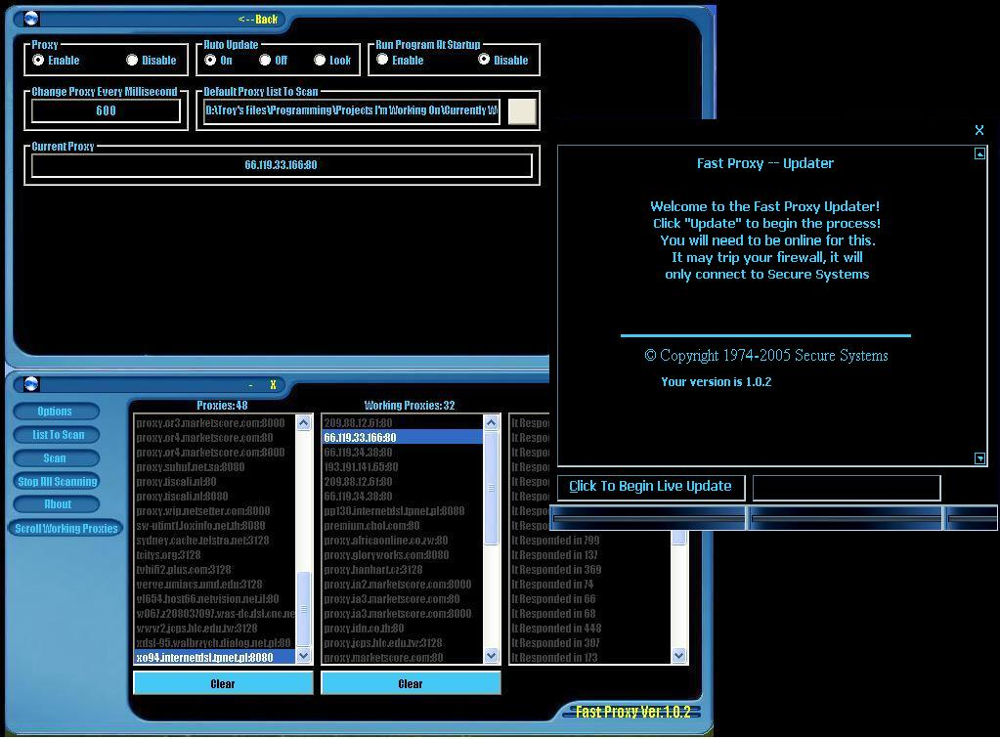



## Fast Proxy

### Description

Scans proxy lists and returns if they are active or not then allows you to scroll through the list changing your ip everytime a new browser is opened. I need to make it detect active proxy by returning header. Rite now basically all it does is ping to see if proxy ip is online or not and trust that you make good proxy list and only add proxy ips to your lists. I think it has potential just needs some TLC.

If you dont have vb runtimes installed or the program crashes you will need the following .dll and .ocx files

comdlg32.ocx,mscomctl.ocx,MSINET.OCX,MSWINSCK.OCX,shdocvw.dll &amp; winmm.dll.

Please be sure to give feed back so I know what I should change or edit it &amp; repost yours.
 
### More Info
 

             |
---                |---
**Submitted On**   |2005-12-04 01:08:56
**By**             |[5656\+65654564](https://github.com/Planet-Source-Code/PSCIndex/blob/master/ByAuthor/5656-65654564.md)
**Level**          |Beginner
**User Rating**    |5.0 (10 globes from 2 users)
**Compatibility**  |VB 6\.0
**Category**       |[Complete Applications](https://github.com/Planet-Source-Code/PSCIndex/blob/master/ByCategory/complete-applications__1-27.md)
**World**          |[Visual Basic](https://github.com/Planet-Source-Code/PSCIndex/blob/master/ByWorld/visual-basic.md)
**Archive File**   |[Fast\_Proxy1953531242005\.zip](https://github.com/Planet-Source-Code/5656-65654564-fast-proxy__1-63481/archive/master.zip)

